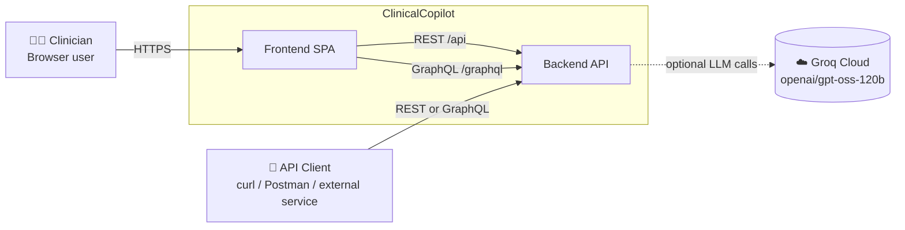
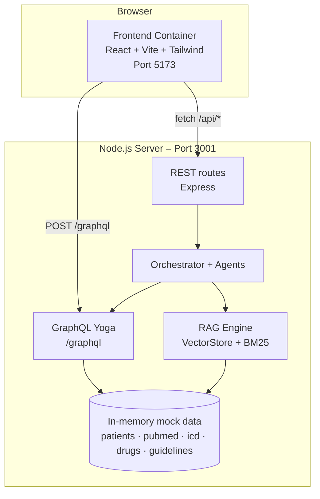
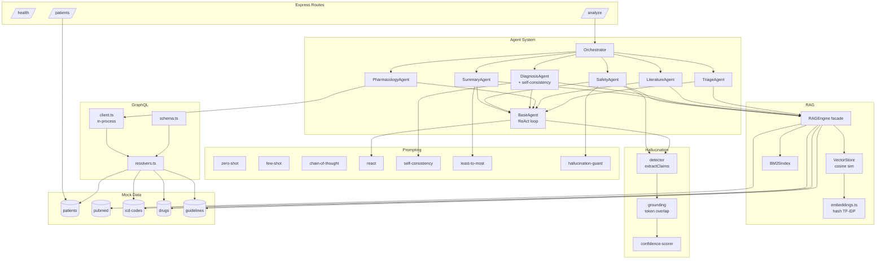
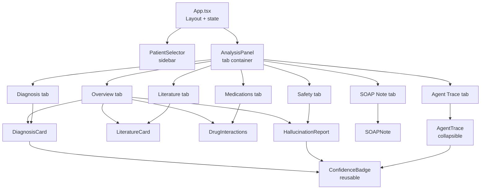
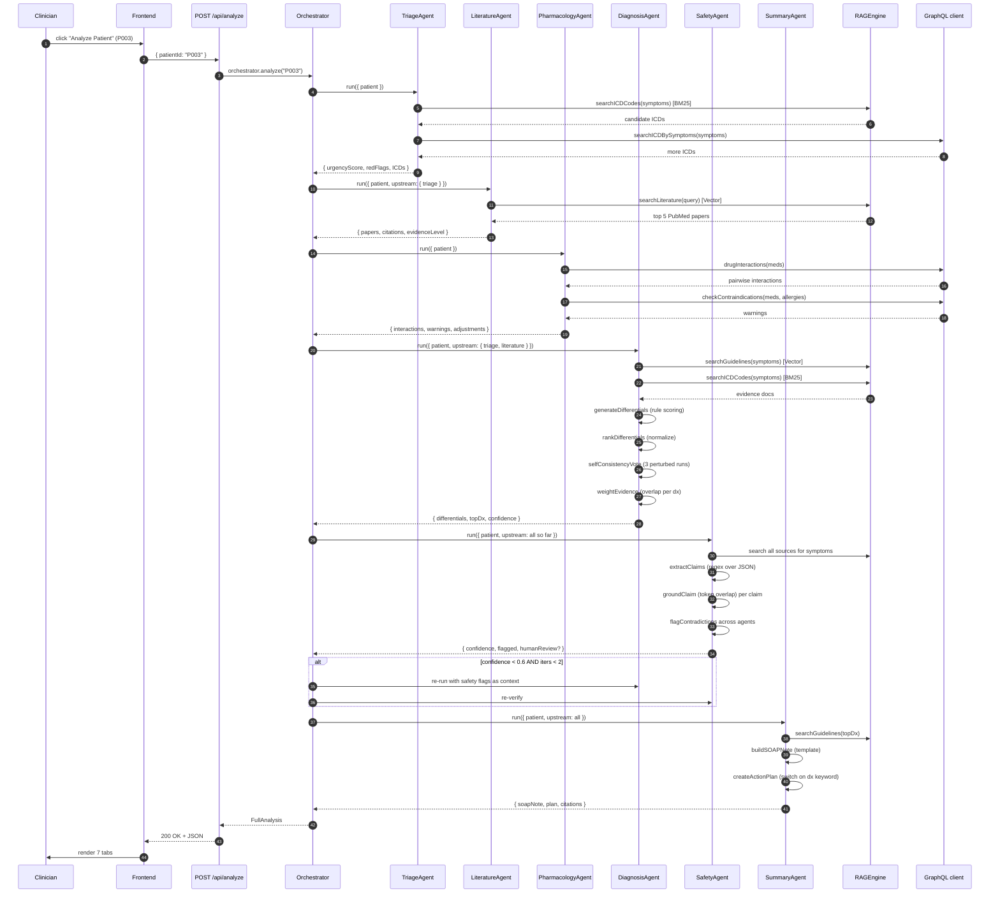
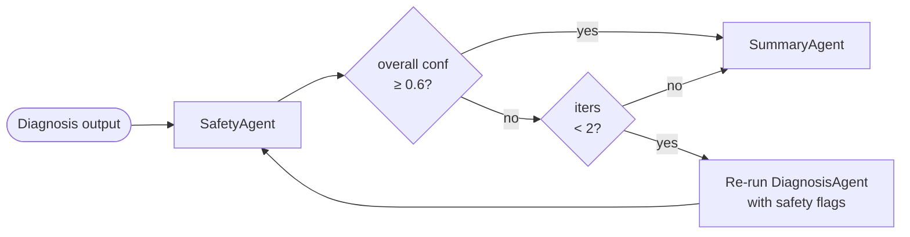
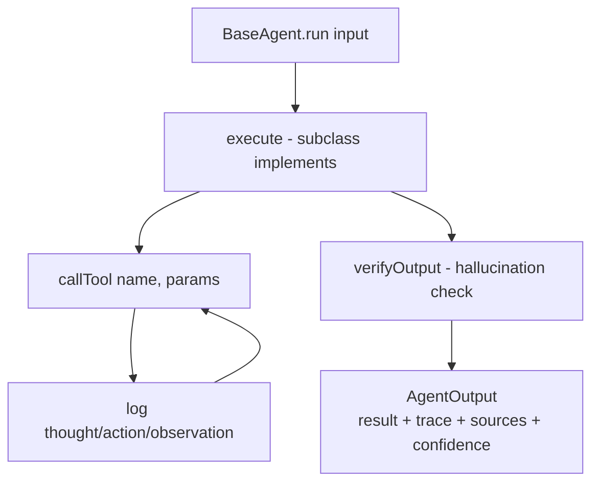

# ClinicalCopilot — System Architecture

This document describes the system at four levels of zoom:

1. **Context** — what's outside the system
2. **Container** — major runtime pieces
3. **Component** — modules inside each container
4. **Runtime sequence** — what happens during one `POST /api/analyze`

Diagrams are written in Mermaid (GitHub renders them natively) with ASCII
fallbacks for plain-text viewing.

---

## 1. Context diagram

Who/what interacts with the system.



ASCII view:

```
┌──────────────┐         ┌──────────────┐
│ Clinician    │────────▶│   Frontend   │
│ (browser)    │  HTTPS  │  React SPA   │
└──────────────┘         └──────┬───────┘
                                │  /api  + /graphql
┌──────────────┐                ▼
│ API Client   │───────────▶┌────────────────┐         ┌──────────────┐
│ (external)   │            │   Backend      │  ─ ─ ─ ▶│   Groq Cloud │
└──────────────┘            │   Express +    │  (opt)  │ gpt-oss-120b │
                            │   GraphQL Yoga │         └──────────────┘
                            └────────────────┘
```

The Groq link is **dashed/optional** — agents reach decisions through
deterministic tools + local RAG today; the LLM is plumbed in but not yet on
the critical path. See [HOW-IT-WORKS.md](HOW-IT-WORKS.md) for what's
hardcoded vs. computed.

---

## 2. Container diagram

The two deployable units and the protocols between them.



ASCII view:

```
┌────────────────────────────────────────────────────────────────────┐
│ Browser (localhost:5173)                                           │
│ ┌──────────────────────────────────────────────────────────────┐  │
│ │  React SPA  (Vite dev server proxies /api → :3001)           │  │
│ └────────┬─────────────────────────────────────┬───────────────┘  │
└──────────┼─────────────────────────────────────┼──────────────────┘
           │ HTTP /api/*                         │ HTTP /graphql
           ▼                                     ▼
┌────────────────────────────────────────────────────────────────────┐
│ Node 20 server (localhost:3001)                                    │
│                                                                    │
│  ┌─────────────────┐    ┌──────────────────────┐                   │
│  │  Express routes │    │   GraphQL Yoga       │                   │
│  │   health        │    │   typeDefs + resolv. │                   │
│  │   patients      │    │                      │                   │
│  │   analyze       │    └─────────┬────────────┘                   │
│  └────────┬────────┘              │                                │
│           ▼                       │                                │
│  ┌──────────────────────┐  in-proc│ client                         │
│  │   Orchestrator       │ ◀───────┘                                │
│  │   (6 specialist      │                                          │
│  │    agents in order)  │                                          │
│  └────┬─────────────┬───┘                                          │
│       │             │                                              │
│       ▼             ▼                                              │
│  ┌─────────┐  ┌──────────────────────┐                             │
│  │ RAG     │  │  Mock data (in-mem)  │                             │
│  │ engine  │──│  5 patients          │                             │
│  │ vector  │  │  30 PubMed papers    │                             │
│  │ + BM25  │  │  50 ICD codes        │                             │
│  └─────────┘  │  40 drugs            │                             │
│               │  10 guidelines       │                             │
│               └──────────────────────┘                             │
└────────────────────────────────────────────────────────────────────┘
```

### Container responsibilities

| Container         | Responsibility                                                          | Tech                            |
| ----------------- | ----------------------------------------------------------------------- | ------------------------------- |
| Frontend SPA      | UI, patient selection, analyze trigger, render results in 7 tabs        | React 18 + Vite + Tailwind      |
| REST API          | Patient list, analyze trigger, health checks                            | Express                         |
| GraphQL API       | Structured queries (drug interactions, ICD search, contraindications)   | graphql-yoga                    |
| Orchestrator      | Sequences agents, applies refinement loop                               | Custom TS                       |
| 6 Agents          | Specialist reasoning (triage / lit / pharma / dx / safety / summary)    | Custom TS, ReAct framework      |
| RAG Engine        | Vector + BM25 retrieval over PubMed, guidelines, ICD, drugs             | Custom TS                       |
| Mock data store   | In-memory typed arrays (no DB needed)                                   | Plain TS modules                |

---

## 3. Component diagram — backend internals



ASCII summary of the same picture:

```
        ┌─ Routes ─┐     ┌─ GraphQL ─┐     ┌─ Prompting (7 files) ─┐
        │ health   │     │ schema    │     │ zero-shot · few-shot   │
        │ patients │     │ resolvers │◀────│ CoT · ReAct            │
        │ analyze ─┼─┐   │ client    │     │ self-consistency       │
        └──────────┘ │   └─────┬─────┘     │ least-to-most          │
                     │         │           │ hallucination-guard    │
                     ▼         │           └────────┬───────────────┘
              ┌────────────────────┐                │
              │   Orchestrator     │                │
              │   ┌──────────────┐ │ uses           │
              │   │  BaseAgent   │─┼────────────────┘
              │   │  (ReAct +    │ │
              │   │   tracing)   │ │
              │   └──────┬───────┘ │
              │          │ extends │
              │  ┌───────┴────────────────────────┐
              │  │ Triage Literature Pharmacology │
              │  │ Diagnosis Safety  Summary      │
              │  └───────┬────────────┬───────────┘
              └──────────┼────────────┼───────────────┐
                         │            │               │
                         ▼            ▼               ▼
                  ┌──────────┐  ┌──────────┐   ┌────────────┐
                  │ RAGEngine│  │ GraphQL  │   │ Hallucin.  │
                  │  Vector  │  │ client   │   │ extract +  │
                  │  + BM25  │  │ (in-proc)│   │ ground +   │
                  └────┬─────┘  └────┬─────┘   │ score      │
                       │             │         └────┬───────┘
                       ▼             ▼              │
                ┌─────────────────────────┐         │
                │   Mock data (in-memory) │◀────────┘ (uses retrieved
                │   patients · pubmed     │            docs as sources)
                │   icd-codes · drugs     │
                │   guidelines            │
                └─────────────────────────┘
```

---

## 4. Frontend component tree



State management is **vanilla React `useState`** — no Redux, Zustand, or
React Query. The data model is:

- `patients: PatientSummary[]` (loaded once on mount)
- `selectedId: string | null`
- `analysis: FullAnalysis | null` (re-fetched per Analyze click)
- `urgencyMap: Record<patientId, urgencyScore>` (decorates sidebar)
- `loading`, `error`

---

## 5. Runtime sequence — `POST /api/analyze`

The full pipeline triggered when a clinician clicks "Analyze Patient".



### Refinement loop



The orchestrator caps refinement at **2 iterations** so the pipeline cannot
loop forever — a small but essential agentic-AI safety pattern.

---

## 6. Data architecture

### Data classification

| Data class           | Volume                    | Storage             | Lifecycle                     |
| -------------------- | ------------------------- | ------------------- | ----------------------------- |
| Mock patients        | 5 records                 | TS module, in-mem   | Read-only, static             |
| PubMed abstracts     | 30 papers                 | TS module, in-mem   | Read-only, static             |
| ICD codes            | 50 records                | TS module, in-mem   | Read-only, static             |
| Drug database        | 40 records                | TS module, in-mem   | Read-only, static             |
| Guidelines           | 10 records                | TS module, in-mem   | Read-only, static             |
| Vector embeddings    | 40 docs × 256 dims        | In-mem, computed at boot | Rebuilt on every restart |
| BM25 index           | 90 docs (icd + drugs)     | In-mem, computed at boot | Rebuilt on every restart |
| Agent trace          | 6–8 agents × ~10 steps    | In-mem per request  | Discarded after response      |
| Analysis result      | ~50 KB JSON               | In-mem per request  | Discarded after response      |

There is **no persistent database**. Everything is in memory. A request is
fully isolated — restarting the server is a clean slate.

### Indexing strategy

```
PubMed papers ──┐
                ├──▶ VectorStore (256-D, hash-TF-IDF)  ──▶ cosine similarity
Guidelines  ────┘

ICD codes  ─────┐
                ├──▶ BM25Index (k1=1.5, b=0.75)  ──▶ tf-idf-like scoring
Drug DB    ─────┘

Patients ───────────▶ GraphQL resolvers (direct array lookup)
```

**Why split?** Vector search is best at semantic similarity (free-text
matching), BM25 is best at exact keyword retrieval (drug names, codes), and
GraphQL is best at structured queries with traversal (drug interactions,
contraindication checks).

---

## 7. Prompting / agent framework



Every agent inherits this loop. The **per-agent variation** is in:

| Slot                       | Implementer                                |
| -------------------------- | ------------------------------------------ |
| `defineTools()`            | Each agent declares its own tools          |
| `execute(input)`           | Each agent orchestrates its tools          |
| Prompt builder used        | Triage → zero-shot, Dx → CoT + self-consistency, … |
| Upstream context consumed  | Orchestrator passes `upstream.*` outputs   |

### Prompt techniques → agent mapping

```
zero-shot              ───────▶ TriageAgent
few-shot               ───────▶ LiteratureAgent, PharmacologyAgent
chain-of-thought       ───────▶ DiagnosisAgent
ReAct                  ───────▶ All agents (via BaseAgent)
self-consistency       ───────▶ DiagnosisAgent (N=3 vote)
least-to-most          ───────▶ SummaryAgent (S→O→A→P)
hallucination-guard    ───────▶ SafetyAgent
```

---

## 8. API contracts

### REST endpoints

| Method | Path                | Body                          | Returns                                |
| ------ | ------------------- | ----------------------------- | -------------------------------------- |
| GET    | `/api/health`       | —                             | `{ status, version, agents[] }`        |
| GET    | `/api/patients`     | —                             | `PatientSummary[]`                     |
| GET    | `/api/patients/:id` | —                             | `Patient` (full)                       |
| POST   | `/api/analyze`      | `{ patientId, query? }`       | `FullAnalysis` (see §5)                |

### GraphQL queries

```graphql
type Query {
  patient(id: ID!): Patient
  patients: [Patient!]!
  drug(name: String!): Drug
  drugInteractions(medications: [String!]!): [DrugInteraction!]!
  icdCode(code: String!): ICDCode
  searchICDBySymptoms(symptoms: [String!]!): [ICDCode!]!
  guidelines(condition: String!): [ClinicalGuideline!]!
  checkContraindications(medications: [String!]!, allergies: [String!]!): [String!]!
}
```

Full SDL in [backend/src/graphql/schema.ts](backend/src/graphql/schema.ts).

---

## 9. Cross-cutting concerns

### Configuration

Source of truth: [backend/src/config.ts](backend/src/config.ts), loading
from `.env`:

```
GROQ_API_KEY    — real key or "placeholder" (forces mock mode)
GROQ_MODEL      — defaults to openai/gpt-oss-120b
PORT            — defaults to 3001
```

Derived flags: `USE_MOCK_LLM`, `confidenceThreshold (0.6)`,
`maxRefinementIterations (2)`.

### Observability

- **Per-agent**: `processingTimeMs`, `ragSourcesUsed[]`, `trace[]`,
  `confidence` — bundled into `AgentOutput` and returned to the client.
- **Per-pipeline**: total `processingTimeMs`, `refinementIterations`,
  `hallucinationReport` — bundled into `FullAnalysis`.
- **Server logs**: `console.log` on boot; no structured logging library
  (intentional, demo-scope).

Frontend renders the full agent trace in the *Agent Trace* tab, making the
system **fully introspectable end-to-end**.

### Error handling

| Layer        | Strategy                                                                 |
| ------------ | ------------------------------------------------------------------------ |
| Express      | `try/catch` in `analyze.ts` → 500 with `{ error: message }`              |
| GraphQL Yoga | Returns errors in `errors[]` array per spec                              |
| Agent tools  | Tool errors are logged into the trace as `observation`, not thrown      |
| Frontend     | `error` state shown in a red banner; analyze button stays enabled        |

### Security (current state)

- **No auth.** This is a demo — every endpoint is open.
- **CORS:** wide open via `cors()`.
- **Body size:** capped at 2 MB.
- **No secrets in repo:** `.env` is `.gitignore`d.
- **Mock data only:** no real PHI/PII.

For a production deployment you'd need: OAuth/OIDC, role-based access,
HIPAA-grade audit log, encrypted at rest, signed agent traces, etc.

### Testing strategy

```
┌─────────────────────────────────────────────────────────────┐
│ Unit tests (Vitest)                  41 tests, <3s          │
│  ┌─────────────────────────────────────────────────────┐    │
│  │ rag · bm25 · graphql · agents · hallucination ·     │    │
│  │ prompts                                             │    │
│  └─────────────────────────────────────────────────────┘    │
└─────────────────────────────────────────────────────────────┘
                              │
                              ▼
┌─────────────────────────────────────────────────────────────┐
│ Smoke tests (bash + curl)            10 checks, <30s        │
│  Starts real server → hits live HTTP → checks JSON shape    │
└─────────────────────────────────────────────────────────────┘
                              │
                              ▼
┌─────────────────────────────────────────────────────────────┐
│ Frontend build (vite build)          static type check + JS │
│  Verifies App.tsx, all components type-check and bundle     │
└─────────────────────────────────────────────────────────────┘
```

---

## 10. Deployment topology (current and future)

### Current (dev mode)

```
┌──────────────┐         ┌──────────────────┐
│ npm run dev  │─runs───▶│ vite (5173)      │  ← frontend, HMR
│ at root      │         └──────────────────┘
│ via          │
│ concurrently │         ┌──────────────────┐
│              │─runs───▶│ tsx watch (3001) │  ← backend, hot-reload
└──────────────┘         └──────────────────┘
```

Both processes run side-by-side. Vite proxies `/api/*` and `/graphql` →
`localhost:3001`.

### Production target (suggested)

```
            ┌─────────────────────────┐
 Clinician─▶│  CDN / Static hosting   │  (frontend dist/)
            │  Vercel · Netlify · S3  │
            └────────────┬────────────┘
                         │ /api, /graphql
                         ▼
            ┌─────────────────────────┐
            │  Node container         │
            │  Fly · Render · ECS     │
            │  • Express + GraphQL    │
            │  • Orchestrator         │
            │  • RAG (in-mem)         │
            └──┬───────────────────┬──┘
               │                   │
               │ (future)          │ (optional)
               ▼                   ▼
        ┌──────────────┐    ┌────────────┐
        │ Postgres /   │    │ Groq Cloud │
        │ Pinecone /   │    │ LLM        │
        │ Qdrant       │    └────────────┘
        │ for real     │
        │ patient and  │
        │ literature   │
        │ data         │
        └──────────────┘
```

Scaling notes:
- Backend is **stateless** (every request is fully isolated, in-mem indexes
  built at boot) → trivially horizontally scalable.
- Boot cost: indexing 40 docs ≈ negligible (< 50 ms). Replace with a real
  vector DB if corpus grows past ~10K docs.
- LLM calls (when enabled) become the latency bottleneck; cache aggressively
  per `(patientId, agentName, inputHash)`.

---

## 11. Tech-stack decision log

| Decision                              | Why                                                                 | Trade-off                                     |
| ------------------------------------- | ------------------------------------------------------------------- | --------------------------------------------- |
| TypeScript strict everywhere           | Catch shape mismatches at build time; agents pass complex objects   | More boilerplate                              |
| No LangChain / LlamaIndex             | Build the patterns from scratch so they're visible and explainable  | Reinvent some wheels                          |
| In-memory vector store, no DB         | Zero infra, deterministic, fast tests                               | Won't scale past a few thousand docs          |
| Hash-based "embeddings" not neural    | Deterministic, offline, free                                        | Semantic quality is approximate               |
| BM25 from scratch                     | Algorithm is short, no `elastic-search` infra needed                | Slower than a real indexer at scale           |
| Groq + `openai/gpt-oss-120b`          | OpenAI-compatible API, very low latency, generous free tier         | One vendor; swap is a 5-line change           |
| GraphQL **and** REST                  | REST for the simple analyze trigger, GraphQL for structured queries | Two endpoints to document                     |
| `graphql-yoga` over Apollo Server     | Lighter, simpler ESM setup                                          | Smaller ecosystem                             |
| Vitest over Jest                      | Native ESM, native TS, sub-second cold start                        | Newer; some Jest plugins unavailable          |
| Bash smoke test (not Playwright)      | Tests the *API surface*, not the DOM — matches what real clients do | No browser-level coverage                     |
| Tailwind, no UI kit                   | Utility classes; no opinion baked in                                | More markup; consistency via convention only  |

---

## 12. Future-state notes (not implemented)

- **Real LLM-driven agents** — swap deterministic tools for
  `llm.chat.completions.create` calls in each agent's `execute()`. Prompt
  builders + ReAct wrapper are already there.
- **Real neural embeddings** — replace `embeddings.ts` with a call to
  OpenAI / Voyage / Cohere; cache by content hash.
- **Persistent vector DB** — Qdrant or pgvector for >10K docs; same
  `VectorStore` interface, just swap the implementation.
- **Streaming responses** — turn `POST /api/analyze` into a server-sent
  event stream so the UI can show each agent's output as it completes.
- **Authentication & audit log** — every analysis would be signed,
  attributed, and retained for clinical-audit purposes.
- **Cross-encoder re-ranker** — improve RAG precision; would fix the
  citation-bleed issue noted in [HOW-IT-WORKS.md](HOW-IT-WORKS.md).
- **Real evaluation harness** — track diagnostic accuracy, F1, calibration
  per patient class over time.

---

## 13. File map ↔ architecture role

| Architectural role            | Files                                                                                  |
| ----------------------------- | -------------------------------------------------------------------------------------- |
| Bootstrap                     | `backend/src/index.ts`, `backend/src/config.ts`                                        |
| REST routes                   | `backend/src/routes/{health,patients,analyze}.ts`                                      |
| GraphQL                       | `backend/src/graphql/{schema,resolvers,client}.ts`                                     |
| Orchestrator + agents         | `backend/src/agents/*.ts`                                                              |
| Prompting framework           | `backend/src/prompts/*.ts`                                                             |
| RAG retrieval                 | `backend/src/rag/{embeddings,vector-store,bm25,rag-engine}.ts`                         |
| Hallucination detection       | `backend/src/hallucination/{detector,grounding,confidence-scorer}.ts`                  |
| Mock data                     | `backend/src/mock-data/*.ts`                                                           |
| Tests                         | `backend/tests/*.test.ts`                                                              |
| Smoke test                    | `smoke-test.sh`                                                                        |
| Frontend shell                | `frontend/src/{App,main}.tsx`, `frontend/src/styles.css`                               |
| Frontend components           | `frontend/src/components/*.tsx`                                                        |
| Frontend types                | `frontend/src/types/index.ts`                                                          |

---

## See also

- [README.md](README.md) — concepts, glossary, how to run
- [HOW-IT-WORKS.md](HOW-IT-WORKS.md) — what is hardcoded vs. computed, panel by panel
